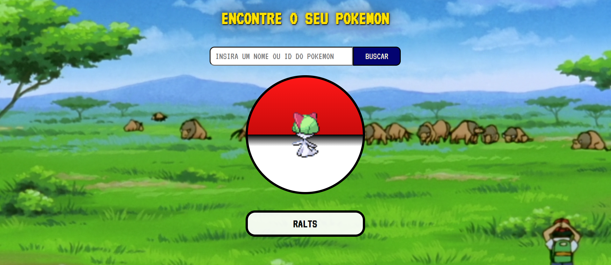

# PokeAPI-React
Criando um buscador de pokemon com React utilizando o PokéAPI.




## Índice 

* [Descrição do Projeto](#descrição-do-projeto)
* [Status do Projeto](#status-do-Projeto)
* [Funcionalidades e Demonstração da Aplicação](#funcionalidades-e-demonstração-da-aplicação)
* [Acesso ao Projeto](#acesso-ao-projeto)
* [Técnicas e Tecnologias Utilizadas](#técnicas-e-tecnologias-utilizadas)
* [Pessoas Contribuidoras](#pessoas-contribuidoras)
* [Pessoas Desenvolvedoras do Projeto](#pessoas-desenvolvedoras)
* [Licença](#licença)
* [Conclusão](#conclusão)


### Descrição do Projeto
Esta é uma Sprint do módulo 5 do curso de Desenvolvedor Web Fullstack da [Resilia Educação](http://resilia.com.br). 

O projeto consiste basicamente em uma *landing page* para buscar Pokemons pelo nome ou ID, fazendo uso da [PokéAPI](https://pokeapi.co/). 


### Técnicas e Tecnologias Utilizadas

- ReactJs
- Vite
- NodeJs
- CSS
- JSON


### Funcionalidades e Demonstração da Aplicação
`Buscar Pokemon`: Basta inserir o nome ou um número (de 100 a 999). 


### Acesso ao Projeto;
O projeto ainda não estpa disponível online. Para acessar, será necessário criar um clone do repositório em sua máquina. 

- Inicializando o git
```javascript
git init
```
- Criando o clone do repositório
```javascript
git clone https://github.com/nathuchoa/PokeAPI-React.git
```

- Entrando na pasta
```javascript
cd vite-project
```
- Instalando o Node e o Vite
```javascript
npm install
```
- Iniciando o projeto
```javascript
npm start
```

Após esses passos, basta entrar no link que ira aparecer no terminal.


### Pessoas Contribuidoras

Este projeto foi desenvolvido em uma aula do módulo 5 da Resilia Educação pela turma T17 em conjunto com a Facilitadora Tech [Inara Almeida](https://github.com/inaralmeida). 

A parte de layout fui desenvolvida exclusivamente por mim (Nathalia)

### Pessoas Desenvolvedoras do Projeto
#### Nathalia Uchôa
Desenvolvedora Web Fullsctack
[Linkedin](https://www.linkedin.com/in/nuchoa/)
 [GitHub](https://github.com/nathuchoa)